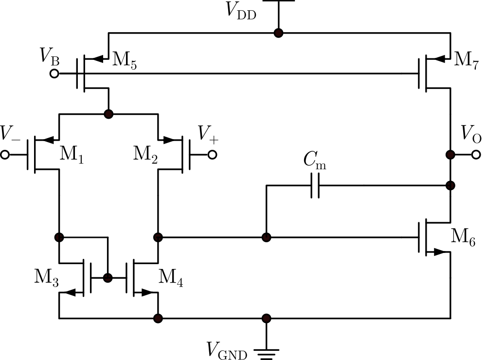
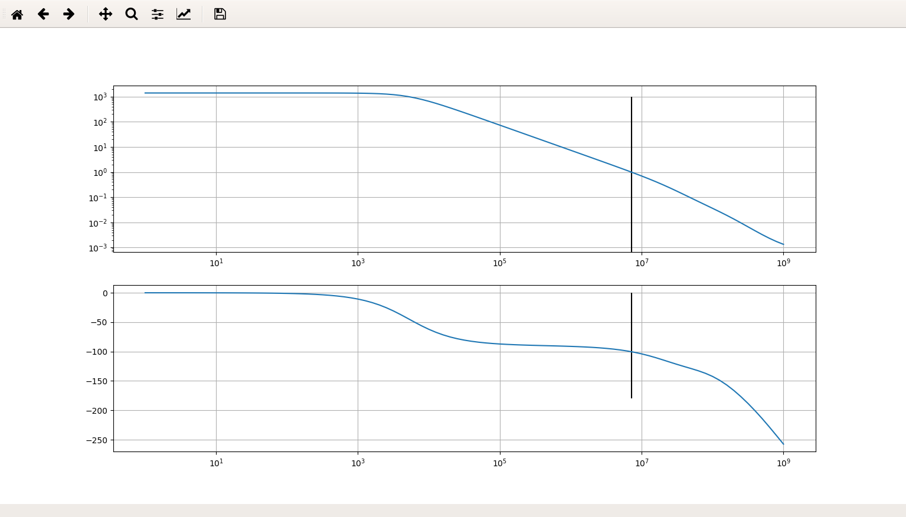

# sizer

Automatically size all design parameters in a circuit to meet design specifications

## Quick start

Note: Windows is currently not supported because the dependency [PySpice](https://github.com/FabriceSalvaire/PySpice) has [an issue](https://github.com/FabriceSalvaire/PySpice/issues/23) with raw data parsing. If you *really* have to try on Windows, you can follow [my comment here](https://github.com/FabriceSalvaire/PySpice/issues/23#issuecomment-452176011). However, it is not a perfect solution because it can't tell if a `\r\n` comes as a part of bytes that represent a number or as just a line break.

1. clone this repo

    ```sh
    git clone https://github.com/aiifabbf/sizer.git
    ```

1. set up a virtual environment (recommended)

    ```sh
    cd ./sizer
    python3 -m venv env
    . env/bin/activate
    ```

    If you have installed numpy, scipy as system-level site packages, you can apply the `--system-site-packages` to avoid duplicate installation.
    ```sh
    cd ./sizer
    python3 -m venv env --system-site-packages
    . env/bin/activate
    ```

1. install dependencies

    ```sh
    pip install -r requirements.txt
    ```

1. install ngspice

    On Debian it is
    ```sh
    apt install ngspice
    ```

1. ready to go! Check out demo!

    ```sh
    python3 demos/two-stage-amplifier/main.py
    ```

## Demo: a simple-Miller compensated two-stage amplifier



Design specifications chosen:
- DC gain >= 1000x
- phase margin >= 60 deg
- bandwidth >= 5 kHz

Variable parameters:
- 12 sizes(width and length) for all MOSFETs(current mirror not shown)
- 1 compensation capacitance

Fixed parameters:
- supply voltage = 3.3 V
- load capacitance = 4 pF
- bias current = 10 uA
- input bias voltage = 1.65 V

[](./demos/two-stage-amplifier/main.py)

After 1 min (on my i5 3rd generation CPU), all 3 specifications are met:
- DC gain ~= 1387x
- phase margin ~= 79.66 deg
- bandwidth ~= 5.298 kHz

Challenge: can you come up with a choice of all MOSFETs' sizes and the compensation capacitance to meet all the design specs **within 1 min?**

## Workflow

1. draw the circuit topology with your favorite tool
1. export your circuit to SPICE netlist

    A typical SPICE netlist might look like [this](./demos/two-stage-amplifier/two-stage-amp.cir)
    ```
    *Sheet Name:/OPA_SR
    V1  Vp GND dc 1.65 ac 0.5
    V2  Vn GND dc 1.65 ac -0.5
    C2  Vout GND 4e-12
    C1  /3 Vout 1e-12
    ...
    ```
    More details about SPICE netlist can be found in [ngspice manual.](http://ngspice.sourceforge.net/docs.html) But for most of the time, you really do not have to write the netlist on your own.

    Note: remember to mark input and output node e.g. `vp, vn, vin+, vin-, vo, vout, vo+, vo-`, because they will be automatically detected later. Currently supports
    - differential input
        - `vin+, vin-` pair
        - `vi+, vi-` pair
        - `vp, vn` pair
    - single input
        - `vin`
        - `vi`
    - differential output
        - `vout+, vout-` pair
        - `vo+, vo-` pair
    - single input
        - `vout`
        - `vo`

    If you don't use the node names above, some convenient performance measurement property like `circuit.bandwidth, circuit.unityGainFrequency` will raise exceptions because it can't find output and input. But if you must, you can still manually extract those values using utility functions in `sizer.calculators`
    ```python
    analysis = circuit.getSmallSignalModel(start=1, end=1e+6, points=10, variation="dec")
    # remember to simulate a frequency range wide enough to cover bandwidth
    frequencies = np.array(analysis.frequencies)
    response = np.array(analysis.nodes["customInputNodeName"]) / np.array(analysis.nodes["customOutputNodeName"])
    bandwidth = sizer.calculators.bandwidth(frequencies, response)
    ```

    [`sizer.calculators`](./sizer/calculators.py) provides many computation utility functions for post-simulation data analysis.

1. put placeholders in the netlist, make it a *template*

    These placeholders represent the variable parameters you would like to optimize in later stages
    ```
    ...
    M7  Vout /6 VDD VDD p_33 l={l7} w={w7}
    M6  Vout /3 GND GND n_33 l={l6} w={w6}
    M2  /3 vp /1 VDD p_33 l={l12} w={w12}
    M1  /2 vn /1 VDD p_33 l={l12} w={w12}
    M4  /3 /2 GND GND n_33 l={l34} w={w34}
    ...
    ```
    Because this project internally use Python to substitute real values into the template, placeholders need to follow [Python's string formatting convention](https://docs.python.org/3/library/string.html#formatstrings). It is not very difficult.

    After this step, save the template file, e.g. `super-cool-two-stage-amplifier.cir`. Also don't forget to add library inclusion statement like `.lib`. But if you really forget it, you can still add it later in the code.

    Also note that the same placeholder name (like `M2`'s length `l` and `M1`'s length `l` are the same, because they are the input MOSFET of the first differential amplifying stage) will be replaced with same number later in optimization. This is particularly helpful if you want to design something symmetrical.

    More features, like parameter multiplying (e.g. make `M2`'s length some 100 times the length of `M1`), will be added soon.

1. read the netlist

    Create a new Python file `super-cool-two-stage-amplifier.py`. We will do our final work in it.

    ```python
    with open("./super-cool-two-stage-amplifier.py") as f:
        template = sizer.CircuitTemplate(f.read(), rawSpice="* other raw spice statements you missed just now")
    ```

1. define functions to measure a candidate circuit's performance, or the so-called *loss function, cost function*

    Sizing a circuit is much like choosing the *right* variable parameter set. Different from what we do in manual design, where we manually solve a set of equations and inequalities to get the optimal set(well, maybe not optimal at all but at least meets all design specs), with sizer we have an *optimizer*, whose strategy is not based on solving equations but rather based on our reaction, or *satisfaction*.

    An optimizer, like a salesman, keeps recommending you with new candidate parameter set, the best he can think of at this time, and we as costumers need to tell the optimizer how happy or satisfied with his recommendation. We have our considerations, such as
    - DC gain no less than 1000x
    - stability must be good (how good? PM > 60 deg)
    - bandwidth no less than 10 kHz
    - ...

    Well, it is too much for a salesman (no offence, otherwise he may call himself an analog engineer) who does not know anything about circuits, let alone how to calculate the performance figures of his recommendations. So, we have to tell the optimizer how happy we are with this candidate. In convention, however, all optimizers are designed to *minimize* something rather than maximize something, so instead of expressing our happiness, we express our unhappiness, namely the *loss*.

    There are many forms of loss you can choose from, e.g.
    ```python
    def gainLoss(circuit):
        return np.maximum(0, 1000 - circuit.gain)
    ```
    this means 
    - once the gain is no less than 1000x, the loss drops to 0;
    - once the gain is below 1000x, the loss is a positive number;
    - the greater the gain is below 1000x, the bigger the loss becomes.

    You can define many losses, to represent multiple design specs, and sum them up to make a single *total loss.*
    ```python
    def loss(circuit):
        return np.sum([
            gainLoss(circuit),
            phaseMarginLoss(circuit),
            bandwidthLoss(circuit)
        ])
    ```
    This example total loss represents
    - when it reaches 0, it means all 3 specs are met simultaneously
    - when it is above 0, it means at least 1 spec is not yet met

1. specify bounds for each variable parameter

    Almost all parameters in a circuit have bounds, due to manufacturing technology or some limitations, e.g. you can't design a MOSFET with length less than 350 nm in a 350 nm technology.
    
    Specify bounds in a Python dictionary object like this. Make placeholders as keys and bounds represented in a tuple or list as values
    ```python
    bounds = {
        "w12": [3.5e-7, 3.5e-4],
        "w34": [3.5e-7, 3.5e-4],
        ...
    }
    ```

1. choose an optimizer

    Aka. choose a good salesman who can respond to your requirement and always precisely recommend the best product.

    ```python
    optimizer = sizer.Optimizer(template, loss, bounds, earlyStopLoss=0)
    ```

    Specify `earlyStopLoss` if you would like the optimizer to stop when loss reaches or reaches below some threshold. If you follow our flow, you can see that our total loss has a minimum of 0 and will never drop below 0, so there is no point to continue optimizing when the total loss is already 0 (meaning all 3 specs are simultaneously met).

1. run it

    With everything ready, we can now run the optimizer.
    ```python
    optimalCircuit = optimizer.run()
    ```

    Once the optimizer returns, the circuit with the optimal parameter set with least loss will be returned. From there, you can read the whole netlist, or do other simulations you want.
    ```python
    print(optimalCircuit.netlist) # print the netlist
    ```
    ```
    # output
    *Sheet Name:/OPA_SR
    V1  Vp GND dc 1.65 ac 0.5
    V2  Vn GND dc 1.65 ac -0.5
    C2  Vout GND 4e-12
    C1  /3 Vout 6.360439624011249e-12
    M7  Vout /6 VDD VDD p_33 l=7.055214917435312e-07 w=0.00018800513394221597
    M6  Vout /3 GND GND n_33 l=3.677720677102635e-07 w=0.00010343168640905428
    M2  /3 vp /1 VDD p_33 l=3.3929182256530286e-06 w=0.000313150065167269
    M1  /2 vn /1 VDD p_33 l=3.3929182256530286e-06 w=0.000313150065167269
    ...
    ```
    ```python
    print(optimalCircuit.unityGainFrequency) # check out the ugf
    print(optimalCircuit.bandwidth) # check out the bandwidth
    print(optimalCircuit.getFrequencyResponse(start=1, end=1e+9)) # get frequency response in a frequency range
    ```

## Why

I enjoy playing with circuit topology, but I am tired of calculating sizes to meet design specifications.

A typical workflow for analog circuit design might be
1. you have a circuit topology
1. list small-signal equations and inequalities according to design specs
1. try solving these equations and inequalities. Most of your time is spent on some ~~nonsense~~ magical assumption that approximates the system to make your life easier ~~hopefully~~.
1. send these manually-calculated parameters to a circuit simulator and check if they work:
    - they work -> hooray
    - they don't work -> go back to step 3
    - you run out of patience and quit the job

A typical workflow with sizer might be
1. you have a topology
1. choose variable parameters and their bounds
1. define a loss function
1. give it to `sizer.optimizers.Optimizer`
1. wait ~~a year~~ until it returns you an optimal set of parameters

It is basically handing the tedious trial-and-error to a program instead of doing everything on our own.

A fundamental idea behind this is that I believe simulators are our friends and the most trustworthy tool throughout the whole design procedure. Although they are *not* the perfect reflection of how our design would work in real life, they are still the closest to it.

I was taught so many times with assertions like
> Don't do simulation until you know what you would expect from your design.

I just don't know...this three-stage amplifier is too complex for my mind.

> Simulators are inaccurate.

but manual calculation is also full of approximation (otherwise you are stuck at workflow 1 step 3), much much more inaccurate than simulators. If you believe in your hand calc, why in the world should you not trust simulators?